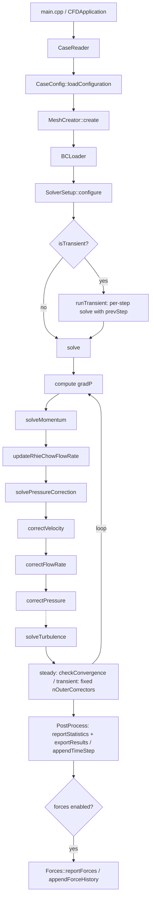

<!--
SPDX-FileCopyrightText: 2025-2026 Mohamed Mousa
SPDX-License-Identifier: Apache-2.0
-->

## Developer Guide

This document explains the internal architecture and implementation details of the CFD solver. It is intended for contributors and users who want to understand, extend, or debug the code.

### Table of contents
- Architecture overview
- Core data structures
- Mesh I/O and topology building
- Boundary conditions system
- Numerical schemes (gradients, convection, diffusion)
- Linear system assembly (`Matrix`)
- Parallelization (MPI)
- SIMPLE algorithm (pressure–velocity coupling)
- Rhie–Chow face-velocity interpolation
- Turbulence model (k–omega SST)
- Post-processing and VTKHDF export
- Linear solvers
- Precision and numerical tolerances
- Extending the codebase (recipes)
- Debugging and tips

### Architecture overview (Current Structure)

Headers (`.h`) and implementations (`.cpp`) live together in the same folder under `src/`,
following the OpenFOAM convention.

- **`src/Primitives/`**: foundation types with no mesh-specific semantics
  - `Scalar.h`, `Vector.h/.cpp`, `Tensor.h/.cpp`, `OptionalRef.h`,
    `ErrorHandler.h`, `Logger.h/.cpp`
- **`src/Mesh/`**: mesh topology, geometric entities and mesh I/O
  - `BoundaryPatch.h`, `Face.h/.cpp`, `Cell.h/.cpp`, `Mesh.h`,
    `MeshReader.h/.cpp`, `MeshChecker.h/.cpp`, `MeshCreator.h/.cpp`
- **`src/Fields/`**: typed field containers and field identity used by all layers
  - `CellData.h`, `FaceData.h`, `Field.h/.cpp`
- **`src/BoundaryConditions/`**: patch metadata and physical BC configuration
  - `BoundaryConditions.h/.cpp`, `BoundaryTypes/` (one class per BC type),
    `BCLoader.h/.cpp`
- **`src/Schemes/`**: discretization schemes, grouped by family
  - `ConvectionSchemes/`: `ConvectionScheme.h/.cpp` (abstract base + runtime selection) plus one
    header/implementation pair per concrete scheme: `UpwindScheme.h/.cpp`,
    `CentralDifferenceScheme.h/.cpp`, `SecondOrderUpwindScheme.h/.cpp`
  - `GradientSchemes/`: `GradientScheme.h/.cpp` (abstract base),
    `LeastSquares.h/.cpp` (least-squares gradient scheme)
  - `Interpolation/`: `LinearInterpolation.h`
  - `TimeSchemes/`: `TimeScheme.h/.cpp` (abstract base + runtime selection)
    plus one header per scheme: `SteadyState.h`, `ImplicitEuler.h`,
    `CrankNicolson.h`, each reporting the d/dt contribution to the implicit
    diagonal and explicit source
- **`src/LinearSystem/`**: algebraic system assembly and solving
  - `Matrix.h/.cpp`, `LinearSolvers.h/.cpp`, `TransportEquation.h`
- **`src/Parallel/`**: MPI runtime, mesh decomposition and inter-rank data movement
  - `MPIRuntime.h/.cpp` (RAII ownership of the MPI runtime), `Comm.h/.cpp`
    (rank identity), `Reduce.h/.cpp` (global reductions),
    `MPIScalarType.h`
  - `MeshDecomposer.h/.cpp` (METIS partitioning into per-rank submeshes),
    `MeshDistributor.h/.cpp` (ships each rank its block), `SubmeshData.h`,
    `DecompositionChecker.h/.cpp` (collective validation of the result)
  - `ProcessorPatch.h` (metadata of one inter-rank cut),
    `HaloExchange.h` (header-only ghost-cell update),
    `GlobalIndex.h/.cpp` (local-to-global cell numbering for PETSc)
- **`src/Solver/`**: segregated pressure–velocity algorithms (a three-level
  hierarchy)
  - `MomentumTransport.h/.cpp`: abstract base and the single driver `solve()`
    (steady with no arguments, transient per step with a `TransientFields*`),
    turbulence advance, convergence/Courant/residual orchestration,
    velocity-gradient reconstruction, and the runtime-selection factory
    `create()` / `availableAlgorithms()` (returns `{"SIMPLE", "PISO"}`). It
    reaches family-specific state through the virtual hooks `faceMassFlux()`
    and `pressureResidual()`; the per-iteration body is the pure-virtual
    `outerIteration()`
  - `Segregated.h/.cpp`: abstract, derives from `MomentumTransport`; the
    pressure-correction / Rhie–Chow machinery shared by all segregated
    algorithms (implicit momentum assembly, the p' Poisson solve,
    velocity/flux/pressure corrections, the momentum diagonal `DU_`/`DUf_`)
  - `SIMPLE.h/.cpp` and `PISO.h/.cpp`: `final : Segregated` leaves that each
    implement only `outerIteration()` + `algorithmName()`. A future
    fully-coupled block-matrix solver would be a sibling of `Segregated`
    under `MomentumTransport`
- **`src/Models/`**: physical models
  - `Turbulence/TurbulenceModel.h` (abstract interface),
    `Turbulence/RANS.h/.cpp` (two-equation eddy-viscosity base),
    `Turbulence/Laminar.h` (laminar null-object),
    `Turbulence/kOmegaSST.h/.cpp` (k–omega SST model)
- **`src/PostProcessing/`**: derived fields and output orchestration
  - `DerivedFields.h/.cpp` (velocity/vorticity magnitude, Q-criterion, strain rate)
  - `PostProcess.h/.cpp` (after-solve statistics and export orchestration)
  - `Forces.h/.cpp` (wall-patch aerodynamic force/coefficient reporting)
  - `VTK/HDF5Wrapper.h/.cpp` (thin helpers over the HDF5 C API for VTKHDF authoring)
  - `VTK/HDF5CellData.h/.cpp` (`.vtkhdf` polyhedral cell/volume data writer)
  - `VTK/HDF5BoundaryData.h/.cpp` (`.vtkhdf` wall/patch boundary face writer)
- **`src/Case/`**: OpenFOAM-style case file parser
  - `CaseReader.h/.cpp`, `CaseConfiguration.h/.cpp`
- **`src/Application/`**: top-level orchestration and solver assembly
  - `CFDApplication.h/.cpp`, `SolverSetup.h/.cpp`
- **`src/main.cpp`**: command-line entry point, creates `CFDApplication` and
  starts the simulation workflow


## Core data structures

### Scalar precision
- `Scalar` is aliased to `double` by default because the CMake option
  `TURBLYZE_USE_DOUBLE_PRECISION` is `ON`; CMake then defines
  `PROJECT_USE_DOUBLE_PRECISION` for the target.
- Switch to float with `-DTURBLYZE_USE_DOUBLE_PRECISION=OFF`. The program
  prints the active mode via `SCALAR_MODE`.
- Global tolerances in `src/Primitives/Scalar.h` (e.g., `smallValue`, `vSmallValue`, `largeValue`).

### Vector
- Simple 3D vector with arithmetic, `dot`, `cross`, `magnitude`, normalization, and stream IO.
- Used throughout for geometry (centroids, normals) and vector fields.

### Fields
- `CellData<T>`: typed cell-centered fields sized from `Mesh::cellCount()`.
- `FaceData<T>`: typed face-centered fields sized from `Mesh::faceCount()`.
- Type aliases:
  - `VectorField`, `ScalarField`, `TensorField`
  - `FaceFluxField` (Scalar), `FaceVectorField` (Vector)

### Mesh entities
- `Face`
  - Topology: `nodeIndices`, `ownerCell`, optional `neighborCell` (boundary if empty).
  - Geometry computed in `geometricProperties(allNodes)`:
    - Triangles via cross product; polygons triangulated about the face center.
    - Fields: `centroid`, `normal` (unit), `projectedArea`,
      `contactArea`, and returned `FaceIntegrals` (`x2`, `y2`, `z2`,
      `volume`).
  - Metric distances `distances(allCells)`:
    - `dPf`, optional `dNf`, and their stored magnitudes.
- `Cell`
  - Topology: lists of `faceIndices`, `neighborCellIndices`, and
    `faceSigns` (owner `+1`, neighbor `-1`).
  - `geometricProperties(allFaces, allFaceIntegrals)`:
    - Volume via divergence theorem: `V = (1/3) Σ (rf · Sf)` using face integrals.
    - Centroid via second-moment accumulation.


## Mesh I/O and topology building

`MeshReader` reads Fluent `.msh` files (3D only):
- Sections: comments `(0)`, dimension `(2)`, nodes `(10)`, cells `(12)`, faces `(13)`, boundaries `(45)`.
- Fluent uses hexadecimal indices for declarations; helpers convert hex→dec robustly.
- Faces section returns owner and optional neighbor cell; neighbor absent implies boundary.
- Boundaries section maps `zoneIdx` to `BoundaryPatch` name/type via `MeshReader::mapFluentBCToEnum`.
- After reading:
  - Builds `Cell.faceIndices`, `Cell.faceSigns` (+1 owner, -1 neighbor),
    and `neighborCellIndices`.
  - Validates face node counts plus owner/neighbor cell index ranges; prints
    a summary.

Notes:
- Any mesh dimension other than `3` is rejected early.
- Fatal errors route through `FatalError`, which prints source location and
  aborts the process rather than throwing exceptions.


## Boundary conditions system

### Architecture
**Classes**:
- `BoundaryPatch`: Mesh patch metadata (name, Fluent type, `zoneIdx`, first/last face indices)
- `BoundaryType` (`src/BoundaryConditions/BoundaryTypes/`): abstract base of one
  polymorphic boundary condition per (patch, field) pair; one derived class
  per type: `FixedValue` (+ `NoSlip`), `FixedGradient`,
  `ZeroGradient` (+ `WallFunction` marker), `Symmetry`
- `BoundaryConditions`: owner of the cold `BoundaryType` registry, the hot
  per-field coefficient arrays, the shared boundary-geometry cache, and the
  per-face trait flag arrays

### The coefficient contract
Every boundary condition linearizes its physics into two channels, written
patch-wise by `BoundaryType::updateCoeffs()` into flat compact-boundary-indexed
arrays (`BoundaryCoeffs`):

- **value channel**: `φf = a·φP + b` — consumed by `boundaryFaceValue()`
  (gradient stencils, Rhie-Chow face velocities, forces) and by the
  convection contribution of `Matrix::assembleBoundaryFace()`
- **gradient channel**: diffusive flux `diag += -Γf·|Sf|·c`,
  `rhs += Γf·|Sf|·d` — consumed by `Matrix::assembleBoundaryFace()`

Per class: `FixedValue(v)`: `a=0, b=v, c=-dm, d=v·dm` (`dm` is the
orthogonal diffusion metric `|Ef|/(|Sf|·|dPf|)`); `FixedGradient(g)`:
`a=1, b=g·dn, c=0, d=g`; `ZeroGradient` and the wall-function markers:
`a=1, b=0, c=0, d=0`; `Symmetry` on velocity component `i`:
`a=1-nᵢ², b=-nᵢ·UnCross, c=-nᵢ²·dm, d=-nᵢ·UnCross·dm` (the mirror value
`Uf = UP - (UP·n)n` and its implicit normal-diffusion coupling), scalars
zero-gradient. Hot loops read only these arrays and the trait flags — no
per-face type dispatch or map lookups.

**Trait queries** replace scattered type tests: `fixesValue()` (pressure
anchor detection), `constrainsZeroFlux()` (Rhie-Chow flux zeroing at
symmetry), `correctsBoundaryFlux()` (boundary p'-gradient flux correction),
`isWallModelled()` (turbulence wall-function activation),
`contributesToLimiterHull()` (Barth-Jespersen hull membership), and
`pressureCorrectionCompanion()` (the p' BC implied by a p BC, enforced at
load time).

**Evaluation cadence**: `BoundaryConditions::updateCoeffs(Ux, Uy, Uz)` is
called from the `Segregated` constructor, at the top of each momentum
component's build in `solveMomentum` (so symmetry cross-terms see the
just-solved previous component, Gauss-Seidel style), and at the top of
`updateVelocityGradients` (which also covers PISO's explicit PRIME sweep via
`assembleMomentum`). Only `Symmetry` on velocity reads `U`; the call is
rank-local and boundary-only.

**Key features**:
1. **Direct Patch Lookup**: `Face::patch()` returns an `OptionalRef<BoundaryPatch>` linked at startup via `BoundaryConditions::linkFaces()`
2. **Per-Component Velocity BCs**: velocity has no vector BC type: it is registered as three independent scalar BCs under `Field::Ux/Uy/Uz`; `BoundaryType::create()` picks the component from the case file's `U` vector
3. **Registration**: `BCLoader` parses each `boundaryConditions` sub-section and calls `BoundaryType::create(typeName, field, patchSection)`; `setBoundaryType()` stores the object; `finalize()` seals the registry and builds the trait flag arrays; `symmetry` is mesh-derived (`PatchType::symmetry`) and never case-file selectable
4. **Boundary Value Calculation**: `boundaryFaceValue()` resolves `a·φP + b` for any field: every field (`Ux`, `Uy`, `Uz`, `p`, `pCorr`, `k`, `omega`, `nut`) is scalar

**Error handling**:
- A missing (patch, field) registration is a fatal error at first
  evaluation (`boundaryFaceValue`, matrix assembly, or `boundaryType()`),
  matching the historical `fieldBC()` behavior; there is no zero-gradient
  fallback.
- An unknown type token is a fatal error at load time, validated against
  `BoundaryType::availableTypes(field)`.
- Boundary faces must be linked to patches before solving; unlinked faces are
  fatal errors.


## Numerical schemes

### Gradient reconstruction (`GradientScheme` / `LeastSquares`)

`GradientScheme` is an **abstract base class**: it owns the scheme-independent
services (`faceGradient`, `limitGradient`, `fieldGradient`, plus the private
`averageFaceGradient`/`boundaryFaceGradient` helpers) and declares one pure
virtual operation, `cellGradient`. The base constructor is `protected` and the
destructor is `virtual`; copy/move are deleted (it holds `const Mesh&` and
`const BoundaryConditions&` references, now `protected` so derived overrides can
read them). `fieldGradient` is a template method: it loops `cellGradient()`
(dispatched through the vtable) then applies `limitGradient()`, so it needs no
changes when a new scheme is added.

`LeastSquares final : public GradientScheme`
(`src/Schemes/GradientSchemes/LeastSquares.h/.cpp`)
is the only concrete scheme today. It owns the least-squares-specific
`precomputeInverseATA()` and the cached `invATA_` table, and overrides
`cellGradient`. The factory `GradientScheme::create()`
(`src/Schemes/GradientSchemes/GradientScheme.cpp`) selects it from
`numericalSchemes.gradient` (default `leastSquares`); an unknown name is a fatal
error. To add another scheme (e.g. Green–Gauss), derive a new `final` class,
override `cellGradient`, and add one branch to the factory.

#### Cell Gradient Computation (`cellGradient` in `LeastSquares`)
**Method**: Weighted least-squares gradient reconstruction

**Algorithm**:
1. **Geometric precompute**: `LeastSquares` builds one inverse `ATA` per
   cell in its constructor from neighbor-cell and boundary-face stencil
   vectors.
2. **Weight Calculation**: `w = 1/(|r|² + smallValue)` for
   inverse-distance-squared weighting.
3. **Matrix Assembly**: Form normal equations `ATA·∇φ = ATb`
   - `ATA = Σ w·(r ⊗ r)` (3×3 matrix, cached as its inverse)
   - `ATb = Σ w·Δφ·r` (3×1 vector, rebuilt for each field)
4. **Solution**: Multiply by cached `invATA`; the precompute uses Eigen LLT,
   then FullPivLU fallback. Degenerate cells get a zero inverse and a warning.

#### Face Gradient Computation (`faceGradient`)
**Method**: Corrected interpolation of cell gradients for internal and processor-halo faces

**Algorithm**:
1. **Distance Calculation**: `d_PN = centroid_N - centroid_P`
2. **Average Gradient**: Distance-weighted interpolation via `averageFaceGradient()`
3. **Consistency Correction**: `correction = (φ_N - φ_P)/|d_PN| - (∇φ_avg · e_PN)`
4. **Final Result**: `∇φ_f = ∇φ_avg + correction × e_PN`

**Face Gradient Averaging (`averageFaceGradient`)**:
- **Weights**: `g_P = d_Nf/(d_Pf + d_Nf)`, `g_N = d_Pf/(d_Pf + d_Nf)`
- **Formula**: `∇φ_f = g_P × ∇φ_P + g_N × ∇φ_N`
- **Physical meaning**: Closer cell has more influence

### Convection schemes (`ConvectionScheme`)

#### Upwind Differencing Scheme (UDS)
**Coefficients**: 
- `a_P_conv = max(massFlowRate, 0.0)`
- `a_N_conv = min(massFlowRate, 0.0)`

**Flow Direction Logic**:
- **Forward flow** (`mdot > 0`): Use owner cell value
- **Reverse flow** (`mdot < 0`): Use neighbor cell value
- **Sign handling**: `a_N_conv` correctly receives negative flow rates

**Properties**: First-order accurate, unconditionally stable

#### Central Difference Scheme (CDS)
**Implementation**: Deferred correction approach

**Matrix Coefficients**: Same as UDS for stability
**Correction Term**: `mdot × (φ_central - φ_upwind)`

**Face Value Calculation**:
```cpp
const Scalar wN = d_P / (d_P + d_N);
φ_f = (1 - wN) * φ_P + wN * φ_N;
```
where `wN` is the neighbor-cell distance weight used by the
`interpolateToFace()` free function in `LinearInterpolation.h`.

**Features**:
- Second-order accurate on structured grids
- Does not add an extra face-gradient term to the CDS deferred correction
- Stable via deferred correction approach

#### Second-Order Upwind (SOU)
**Implementation**: Gradient-based extrapolation

**Face Value Calculation**:
```cpp
if (upwind_cell == owner)
    φ_f = φ_P + (∇φ_P · d_Pf)
else
    φ_f = φ_N + (∇φ_N · d_Nf)
```

**Correction Term**: `mdot × (φ_SOU - φ_UDS)`

**Properties**: Second-order upwind reconstruction using the limited cell
gradients supplied by `GradientScheme`; there is no separate TVD flux limiter.

### Diffusion treatment
**Orthogonal Component**: Handled implicitly via the over-relaxed vector
`E_f = (S_f · S_f)/(S_f · e_PN) e_PN` for internal faces (with `e_Pf` on
boundary faces)
**Non-orthogonal Correction**: Explicit via `T_f = S_f - E_f` using face gradients
**Formula**: `Gamma_f (∇φ_f · T_f)` is added to the owner RHS and subtracted
from the neighbor RHS on internal faces


## Linear system assembly (`Matrix`)

Uses a unified `TransportEquation` struct to bundle all data for any transport
equation (momentum, pressure correction, turbulence). Gradients, mass fluxes,
and face diffusion coefficients are prepared by solver/model code, not in
`Matrix`.

### TransportEquation struct
```cpp
struct ConvectionTerm
{
    const FaceFluxField& flowRate;       // Face flow rates
    const ConvectionScheme& scheme;     // Convection discretization
};

struct TransientTerm
{
    const TimeScheme& scheme;            // d(phi)/dt discretization
    Scalar deltaT;                       // Time step size
    const ScalarField& phiPrevStep;      // Field at previous time step (phi^n)
    const ScalarField* ddtPrevStep;      // Stored previous-step derivative (CN; nullptr otherwise)
};

struct TransportEquation
{
    Field field;                        // Ux, Uy, Uz, p, pCorr, k, omega, nut
    ScalarField& phi;                   // Current field values (mutable for zero-copy solve)
    std::optional<TransientTerm> transient = std::nullopt;  // d/dt term (nullopt = steady)
    std::optional<ConvectionTerm> convection = std::nullopt;
    const FaceFluxField& GammaFace;      // Face-based diffusion coefficient
    const ScalarField& source;          // Explicit source term
    const VectorField& gradPhi;         // Pre-computed cell gradients
    const GradientScheme& gradScheme;
};
```

### Unified build method
`buildMatrix(const TransportEquation& eq)`:
- Single method handles all equation types:
  - **Momentum**: convection + diffusion via face-based `GammaFace` (`nuEffFace_`)
  - **Pressure correction**: face-based diffusion via `GammaFace` (DUf), no convection (`convection = nullopt`)
  - **Turbulence k/omega**: convection + precomputed face diffusion
- Internal faces: assembles diffusion and convection with non-orthogonal correction
- Boundary faces: handles fixedValue, zeroGradient, noSlip, and wall function types
- Deferred-correction for CDS/SOU added to RHS
- Transient term (when `eq.transient` is set): a per-cell pass adds the time
  scheme's `V/Δt`-based contribution to the diagonal and the corresponding
  explicit source from `phi^n` (and, for Crank-Nicolson, the stored
  previous-step derivative). The coefficients are kinematic (no `rho`); `steadyState` leaves
  `eq.transient` empty so the loop is skipped.

### Under-relaxation
`relax(α, φ_prev)` performs Patankar-style implicit relaxation by scaling the diagonal and adjusting RHS with the previous state.

### Explicit PRIME sweep
`explicitJacobiUpdate()` performs the explicit PRIME momentum sweep: a single
Jacobi update of the velocity components from the assembled diagonal, the
off-diagonal neighbor contributions, and the RHS with no linear solve and no
relaxation. PISO's corrector steps use it to advance momentum with the current
flux before each pressure correction.


## Parallelization (MPI)

The solver is parallelized by MPI domain decomposition only — there is no
shared-memory threading, so each rank is single-threaded. The same binary
serves both cases: `./Turblyze case` runs serially, `mpirun -np N ./Turblyze
case` in parallel, with no case-file changes.

Decomposition happens at runtime in `MeshCreator::create()`. The master rank
reads the complete mesh, `MeshDecomposer` partitions it with METIS on the cell
dual graph and extracts one `SubmeshData` block per rank, `MeshDistributor`
ships the blocks, and `DecompositionChecker` collectively validates the result.
Each rank then owns a submesh whose cell list is `[owned cells | ghost tail]`:
solver and assembly cell loops run over `mesh.numOwnedCells()`, and the ghost
cells beyond that bound are read-only copies of neighbor ranks' cells, refreshed
by communication. Every inter-rank cut is a `ProcessorPatch`, and the faces on
it carry `PatchType::processor` — so any patch loop that means "physical
boundary" must skip `PatchType::processor` patches. `GlobalIndex` maps owned
cells to the rank-major global numbering PETSc assembles against.

Ghost values are updated by `exchangeHalos(mesh, {...})` from `HaloExchange.h`.
The rule: after any write to owned-cell values that a face kernel or stencil
later reads across a partition cut, `exchangeHalos` must run before that read.
Because one call sends a single packed message per neighbor rank, fields
produced together should be batched into ONE call rather than exchanged
individually. Call sites in `Segregated.cpp`, `PISO.cpp`,
`MomentumTransport.cpp`, `kOmegaSST.cpp` and `RANS.cpp` are the worked examples.

The overriding correctness constraint is lockstep: every rank must reach every
collective — reductions (`globalSum`/`globalMax`/`globalMin`/`globalOr`), halo
exchanges, collective HDF5 writes, and collective constructors. Never guard a
collective with a per-rank condition; a missing collective on one rank is a
hang, not an error message. A missing or misplaced halo exchange fails silently
instead, converging to a subtly wrong answer.

`.claude/rules/parallel.md` and `docs/MULTI_GPU_DESIGN.md` § 2.5 are the
authoritative contracts — § 2.5 lists exactly which fields are exchanged where
in one outer iteration. The implementation lives in `src/Parallel/`.


## SIMPLE algorithm

Entry point: the shared driver `MomentumTransport::solve()` loops `SIMPLE::outerIteration()` until convergence or `maxIterations`:
1) Store previous-iteration fields (U, face velocities, flow rates), compute gradP.
2) `solveMomentum()`: computes velocity gradients once into the `gradU_` member, then loops the `Ux_`/`Uy_`/`Uz_` component equations the solver owns directly, each with `buildMatrix()` + Patankar relaxation + implicit solve.
3) `updateRhieChowFlowRate()`: compute Rhie-Chow face mass fluxes.
4) `solvePressureCorrection()`: pre-compute mass imbalance source, reset p' and grad(p') to zero, then build and solve the p' equation using `buildMatrix()` with face-based diffusion (DUf), no convection. `SIMPLE.nNonOrthogonalCorrectors` extra loop passes re-assemble with the explicit non-orthogonal correction from the latest grad(p') and re-solve (simpleFoam's non-orthogonal pressure corrector loop, where the first solve always carries a zero correction because p' restarts from zero).
5) `correctVelocity()`: update U using `U = U* - D ∇p'`.
6) `correctFlowRate()`: update face mass fluxes.
7) `correctPressure()`: apply `p = p + α_p p'` (p' is reset at the next iteration's corrector-loop entry).
8) `solveTurbulence()`: advance k–ω SST using current fields and velocity gradients `gradU_` (if enabled).
9) `checkConvergence()`: monitor mass imbalance (normalized per-cell average), velocity residual (normalized L2), and pressure correction residual (normalized RMS).

Controls:
- `SIMPLE` is fully initialized by its constructor. Runtime controls (rho, mu,
  initial fields, under-relaxation factors, tolerances, debug
  flag) are passed as individual constructor parameters, OpenFOAM-style, with no
  intermediate POD config struct. The two linear solvers (`momentum`,
  `pressure`) are likewise passed as plain `LinearSolver&` parameters.
- Turbulence is **not owned by `SIMPLE`**. `SolverModules` owns
  `unique_ptr<TurbulenceModel>` as a sibling of the SIMPLE solver and
  constructs it *before* SIMPLE (mirroring `simpleFoam`'s `createFields.H`
  ordering). A non-owning `TurbulenceModel&` is passed as the final constructor
  argument to `SIMPLE`; it is always valid: a `Laminar` null-object represents
  the laminar path instead of `nullptr`.
- `CaseConfig::loadConfiguration()` parses non-BC runtime input into
  `CaseConfiguration`. `SolverSetup::configure()` owns selected linear
  solvers, gradient and convection schemes, the turbulence model
  (`kOmegaSST` or `Laminar`), and the time scheme (`TimeScheme::create`)
  through `SolverModules`, then constructs `SIMPLE` last so it is destroyed
  first.

### Transient (URANS) solve

`MomentumTransport` (the abstract base of `SIMPLE`/`PISO`) holds a
`const TimeScheme&` plus the time-step controls (`deltaT_`, `nOuterCorrectors_`).
`isTransient()` simply forwards `TimeScheme::isTransient()`,
which `CFDApplication::run()` uses to branch between two private paths:

- `runSteady()`: calls `solve()` once (the loop above), then post-processes
  and exports once.
- `runTransient()`: constructs the two stateful VTKHDF writers as locals
  (and the optional forces history CSV), writes the geometry once, appends
  the t = 0 state, then for each step `1 … round(totalTime/deltaT)` calls
  `solve(step, totalSteps, time, &prevStep)` and appends output at the
  `writingIntervals` cadence (the final step is always written). It
  finalizes both writers and prints the final-step statistics
  afterward. `runTransient()` also owns one value-owning `TransientFields`
  bundle (the previous-step `phi^n` and the converged `t^n` face flux) as a
  local and threads its address into `solve()`, so the solver keeps no
  transient-only members.

`MomentumTransport::solve()` per step (the shared `SIMPLE`/`PISO` driver):
1. Snapshots `phi^n` and the converged `t^n` face flux (used for the Rhie–Chow
   ddt consistency term) into the caller-owned `TransientFields` bundle whose
   address `runTransient()` passes in, and calls
   `turbulence_.beginTimeStep()`. There are no transient-only solver members;
   the shared read path takes a nullable `const TransientFields*` (`nullptr`
   when steady).
2. Runs up to `nOuterCorrectors_` outer iterations (the transient path is
   PISO-only) so each is one PISO `outerIteration()` (predictor plus
   `nPrimeCorrectors` PRIME correctors) and the loop stops as soon as the step
   reaches per-step convergence (drop the tolerance to force more iterations).
   Per-iteration residual lines are emitted only in debug mode, so a non-debug
   run prints one summary line per time step.
3. Rolls the Crank-Nicolson stored previous-step derivatives forward
   (`updatePrevStepDerivatives()` for momentum and `turbulence_`).

Each momentum, k, and omega `TransportEquation` carries a `TransientTerm` on the
transient path; the pressure-correction equation never does. `RANS` mirrors the
previous-step bookkeeping (`kPrevStep`/`kDdtPrevStep`) so URANS turbulence
transport is consistent with the momentum time scheme.


## Rhie–Chow face-velocity interpolation

Used in `updateRhieChowFlowRate()` to prevent pressure checkerboarding:
- Start with linear-interpolated internal-face velocity `U_f_lin`.
- Compute face D-like coefficient from interpolated momentum diagonals and geometry.
- Apply the pressure-gradient correction to the face flux:
  `F_f = U_f_lin·S_f - D_f(∇p_f - ∇p_f_lin)·S_f`.
- Add previous-iteration face under-relaxation as
  `(1-α_U)(F_f_prev - U_f_prev·S_f)`.
- Boundary faces use centralized BC evaluation.


## Turbulence models (TurbulenceModel / RANS / kOmegaSST / Laminar)

Turbulence models implement the storage-free `TurbulenceModel` interface
(`src/Models/Turbulence/TurbulenceModel.h`). The root type exposes only
the hooks SIMPLE and post-processing need: turbulent viscosity, optional
boundary turbulent viscosity, the turbulence solve step, wall-distance status,
named VTK output fields, and named convergence residuals. It does not own mesh
or field storage.

`Laminar` (`Laminar.h`) is the null-object model for non-turbulent runs:
it owns a zero `nut` field, returns no residual or VTK output fields, and
reports `isTurbulent() == false`. Its `solve()` hook is a no-op. Force
reporting uses `TurbulenceModel::wallShearStress(Ux, Uy, Uz)`, which lets
Laminar compute kinematic wall shear stress on demand from the owner-cell
tangential velocity and laminar viscosity while RANS models return their
wall-function shear field for the current model state and velocity fields
through the same interface.

`RANS` (`RANS.{h,cpp}`) is the shared two-equation eddy-viscosity layer. It
owns `nu`, `nut`, `k`, k/dissipation residual bookkeeping, wall distance,
wall-function geometry/diagnostics (`nutWall`, `yPlus`), and common helpers
such as `velocityDivergence()`, strain-rate magnitude computation, on-demand
wall-shear evaluation, and the turbulent-kinetic-energy inlet estimate.

Class `kOmegaSST`:
- Is fully initialized by its constructor from inlined parameters (laminar
  viscosity, initial k/omega, under-relaxation factors, debug flag), with no
  config-struct indirection.
- Owned by `SolverModules` as a sibling of `SIMPLE`; never owned by `SIMPLE`
  itself. SIMPLE holds a non-owning, non-const `TurbulenceModel&` (a `Laminar`
  null-object replaces the former `nullptr` for laminar runs, so the reference
  is always valid; the reference, not a pointer, encodes that invariant).
- Inherits common RANS state and owns only SST-specific persistent state such
  as `ω`, its previous-iteration snapshot, SST constants/options, and dynamic
  omega wall-function values.
- Borrows mesh, boundary conditions, gradient scheme, per-equation
  convection schemes, and the `k`/`omega` linear solvers (all bound at
  construction). It does not own any of them.
- `solve(Ux, Uy, Uz, flowRateFace, gradU)` accepts pre-computed velocity
  gradients from `SIMPLE`; the linear solvers were captured by reference in
  the constructor and are not passed per call.
- Solves ω and k transport with variable diffusion (`ν + σ·ν_t`), production/destruction, and cross-diffusion for SST.
- Calculates blending functions `F1`/`F2`/`F23`, turbulent viscosity
  `ν_t = a1 k / max(a1 ω, F23 ||S||)`, and applies wall corrections. These
  per-iteration fields are local scratch returned from helper methods, not
  persistent members.
- Provides model output through the base enumeration hooks
  (`cellDataOutputs`/`boundaryDataOutputs`): `k`, `ω`, `nut`, `wallDistance`,
  and `yPlus`. Wall shear stress is exposed separately, through the dedicated
  `wallShearStress(Ux, Uy, Uz)` query rather than these enumeration hooks.
- Implements the `TurbulenceModel::wallShearStress(Ux, Uy, Uz)` interface by
  returning the RANS wall-function shear field for the current model state and
  velocity fields. The returned value is kinematic `tau/rho` on boundary
  faces.


## Post-processing and VTKHDF export

Output is written in the VTKHDF format (format version 2.4) directly through
the HDF5 C library. The solver has no dependency on the VTK library itself.
Read the files with ParaView 6.1+ (VTK 9.6): VTK 9.5-based readers
(ParaView 5.13–6.0) load VTK_POLYHEDRON VTKHDF grids through a per-cell
decomposition path that is pathologically slow at production mesh sizes;
VTK 9.6 replaced it with a bulk array attach (verified: 281k cells load in
under a second on 6.1 vs 10+ minutes on 9.5.2). Three pairs under
`src/PostProcessing/VTK/` implement the export:

`HDF5Wrapper.h/.cpp` (namespace `VTK::HDF5`):
- Thin helpers over the HDF5 C API shared by both writers: file/group
  creation, attribute writing (`Version`, `Type`, `NSteps`), fixed
  write-once datasets, and extensible append-per-step datasets grown in
  place via `H5Dset_extent` + hyperslab writes.
- Every failing HDF5 status funnels into `FatalError`; datasets use explicit
  little-endian file types; large arrays are chunked with shuffle + gzip.
- Dataset rank is encoded by the `columns` parameter (`0` = one-dimensional)
  because VTKHDF distinguishes `[NSteps]` arrays from `[NSteps, NTopologies]`
  even when `NTopologies` is 1.

`HDF5CellData` (volume):
- A stateful writer holding the open HDF5 file across a run:
  construct -> `writeGeometry()` (once) -> `appendTimeStep()` per written
  step -> `finalize()`. Owned as a local in `runTransient()`; the steady
  path constructs and finalizes it inside `PostProcess::exportResults()`.
- `writeGeometry()` writes every volume cell as `VTK_POLYHEDRON` (type 42):
  per-cell unique point lists in `Connectivity`/`Offsets`/`Types` plus the
  polyhedron face datasets `FaceConnectivity`/`FaceOffsets`/
  `PolyhedronToFaces`/`PolyhedronOffsets`. Faces are emitted once per owning
  cell (no global dedup), so `PolyhedronToFaces` is the identity and
  `PolyhedronOffsets` a running face count.
- Orients each exported polyhedron face with a Newell normal compared against
  `face.centroid() - cell.centroid()`. It does not use `Cell::faceSigns()`,
  because mesh normal correction can flip stored normals without reordering
  face nodes.
- `appendTimeStep()` packs cell fields to 32-bit float, appends them to
  `CellData/<name>`, records the per-array offset under
  `Steps/CellDataOffsets/<name>`, and appends the all-zero geometry offset
  rows (static mesh). `NSteps` is refreshed and the file fully closed after
  every write (reopened on the next), so the series can be read mid-run and
  an interrupted run still leaves a valid file. The field-name set must be
  identical on every step (checked, fatal on mismatch).

`HDF5BoundaryData` (boundary):
- Same lifecycle, `Type = "PolyData"`. Writes all boundary patches by
  iterating `mesh.patches()` in order and each patch's face-index range,
  over a deterministic boundary-only global-to-local point remap. Boundary
  faces fill the `Polygons` topology; `Vertices`/`Lines`/`Strips` exist but
  stay empty.
- Re-appends the static integer metadata arrays `patchIdx`, `patchZoneIdx`,
  `patchTypeIdx`, and `isWall` every step (a temporal reader expects a
  `CellDataOffsets` entry for every cell-data array at every step; the small
  arrays are cheap to repeat). `patchIdx` is the zero-based ordinal in
  `mesh.patches()` order; `patchZoneIdx` is the Fluent zone ID.
- Adds `wallShearStress` for all runs, reduced from global face indexing to
  boundary-face order. Adds `yPlus` only when turbulence is enabled.

`PostProcess::appendTimeStep(volumeWriter, boundaryWriter, time, solver,
turbulence)` gathers the field maps (pressure, `velocityMagnitude`, vector
`velocity`, turbulence cell outputs, boundary outputs + `wallShearStress`)
and feeds both writers; `exportResults()` reuses it for the steady
single-step file.

`Forces::reportForces()`:
- Runs after the SIMPLE solve and result export when the optional `forces`
  case section is enabled.
- Integrates one configured wall patch by reading converged `SIMPLE` velocity
  and pressure fields, mesh face geometry, boundary pressure values, and
  `TurbulenceModel::wallShearStress(Ux, Uy, Uz)`.
- Treats pressure as kinematic pressure, multiplies by `rho`, and uses the
  projected face area vector (`normal * projectedArea`) for pressure loads.
- Treats model wall shear as kinematic `tau/rho`, multiplies by `rho`, and
  uses `contactArea` for friction loads.
- Projects pressure, friction, and total forces onto the configured unit drag
  and lift directions, then computes coefficients with
  `0.5 * rho * |referenceVelocity|^2 * referenceArea`.

### Transient output

The steady path calls `PostProcess::exportResults()` once. The transient path
(`CFDApplication::runTransient()`) owns the two stateful writers as locals
for the lifetime of the time loop:
- `PostProcess::cellDataPath(config)` / `boundaryDataPath(config)` derive
  `<base>.vtkhdf` and `<base>_boundary.vtkhdf` from `output.filename`
  (stripping any known legacy extension such as `.vtu`).
- Both writers are constructed before the loop, `writeGeometry()` runs once,
  the t = 0 initial condition is appended as the first step, each written
  step appends per `time.writingIntervals` (the final step always writes),
  and `finalize()` closes both files after the loop. Both files share
  identical `Steps/Values`, so ParaView animates them in lockstep.
- When `forces.enabled`, `Forces::writeForceHistoryHeader()` /
  `appendForceHistory()` write a `<base>_forces.csv` row per step (including
  t = 0); `Forces::reportForces()` still prints the final-step summary.


## Linear solvers

`LinearSolver` is an abstract base class for sparse iterative solvers.
The single concrete `PetscLinearSolver` owns one PETSc `KSP` configured at
construction; there are no separate `BiCGSTAB`/`PCG` classes. `create()`
maps the selectable name string to a KSP type: `"BiCGSTAB"` to `KSPBCGS`
for non-symmetric momentum/turbulence systems and `"PCG"` to `KSPCG` for
the symmetric positive definite pressure-correction system:
- Per-field solver instances with independent convergence parameters.
- Configurable relative residual tolerance and max iterations.
- `solve(x, A, b)` updates the supplied solution vector in place and caches
  diagnostics in `lastPerformance()` (iterations + final residual).
- A non-finite solution (detected across all ranks via `globalOr`) emits a
  master-gated `Warning` and rolls the field back to the previous iterate.
  Convergence is read from PETSc's `KSPGetConvergedReason()` — a positive
  reason means converged, a negative one diverged — and recorded into
  `lastPerformance().converged` (`!anyNonFinite && reason > 0`); iterations
  and final residual come from `KSPGetIterationNumber` / `KSPGetResidualNorm`.
  Callers read the flag to decide how to react.


## Precision and numerical tolerances

- Precision is selected at configure/build time via
  `TURBLYZE_USE_DOUBLE_PRECISION`; the target compile definition consumed by
  `Scalar.h` is `PROJECT_USE_DOUBLE_PRECISION`.
- Tolerance constants adapt to `Scalar` (e.g., comparisons, divisions, gradient detection).
- Many algorithms include small epsilons to guard against degeneracy.


## Class ownership patterns

The codebase uses explicit special-member declarations when ownership or
borrowing makes compiler-generated operations unsafe. The recurring patterns
are:

### Pattern 1: Non-owning reference member (rule of five, all deleted)

Classes that hold `const T&` or `T&` members borrow an object they do not own.
References cannot be rebound, so copy/move operations are meaningless.

```cpp
/// Copy constructor and assignment - Not copyable (const T& members)
GradientScheme(const GradientScheme&) = delete;
GradientScheme& operator=(const GradientScheme&) = delete;

/// Move constructor and assignment - Not movable (const T& members)
GradientScheme(GradientScheme&&) = delete;
GradientScheme& operator=(GradientScheme&&) = delete;

/// Destructor (virtual, GradientScheme is a polymorphic base)
virtual ~GradientScheme() noexcept = default;
```

Used by: `GradientScheme` (abstract base; `LeastSquares` derives from it),
`Matrix`, `kOmegaSST`, `SIMPLE`. Note the destructor is `virtual` only for
the polymorphic `GradientScheme`; the non-polymorphic borrowers keep a
non-virtual `= default` destructor.

### Pattern 2: Runtime-owned polymorphic services

Polymorphic runtime services are owned through `std::unique_ptr`.
`SolverModules` deletes copy and move because `SIMPLE` stores references into
these services; keeping runtime ownership stationary avoids dangling references.

```cpp
SolverModules(const SolverModules&) = delete;
SolverModules& operator=(const SolverModules&) = delete;

SolverModules(SolverModules&&) = delete;
SolverModules& operator=(SolverModules&&) = delete;

std::unique_ptr<ConvectionScheme> momentumConvectionScheme;
std::unique_ptr<MomentumTransport> solver;  // declared last, destroyed first
```

Used by: `SolverModules`.

### Pattern 3: PETSc KSP-owning solver member (rule of five, copy/move deleted)

`PetscLinearSolver` owns a PETSc `KSP` (a raw resource handle released in the
destructor), so a compiler-generated copy or move would alias or leave a
dangling handle. Solver instances are therefore owned through `std::unique_ptr`,
with copy and move operations deleted.

```cpp
/// Copy and move - deleted; instances are owned through unique_ptr
LinearSolver(const LinearSolver&) = delete;
LinearSolver& operator=(const LinearSolver&) = delete;

LinearSolver(LinearSolver&&) = delete;
LinearSolver& operator=(LinearSolver&&) = delete;

/// Virtual destructor for polymorphic deletion
virtual ~LinearSolver() noexcept = default;
```

### Pattern 4: Rule of zero

Classes with only value or standard-library members (e.g. `std::vector`, `Name`,
`Scalar`) that are fully copyable and movable by the compiler.
Declare nothing; the compiler generates correct defaults.

Used by: `Face`, `Cell`, `BoundaryPatch`, `CellData<T>`, `FaceData<T>`.

### Runtime ownership boundaries

`CFDApplication` is intentionally thin: it owns only the case-file path and
coordinates the phases in `run()`.

`CaseConfiguration` owns typed non-BC runtime input. Boundary conditions are
kept asymmetric by design: `BCLoader` streams the raw
`boundaryConditions` case section directly into `BoundaryConditions` because
the data is patch-indexed and field-specific.

`SolverModules` owns user-selected runtime services:
`GradientScheme`, the default and per-equation `ConvectionScheme`, one
`LinearSolver` instance per solved equation, and a `TurbulenceModel`
(`kOmegaSST` or `Laminar`). `solver` is declared last so it is destroyed before
the services and model whose references are stored by `SIMPLE`.

`SIMPLE` owns the flow solution fields, pressure-correction state,
Rhie-Chow fields, and matrix assembler. It borrows a non-null
`TurbulenceModel&` for the non-const turbulence solve step; it does not own the
model, parse case input, or own linear solver objects.

`RANS` owns shared turbulence fields and wall-function state. `kOmegaSST`
adds SST-specific persistent state and borrows mesh, boundary conditions,
numerical schemes, and the `k`/`omega` linear solvers (all bound at
construction).


## Extending the codebase (recipes)

### Add a new scalar transport equation
1) Add a `Field` enumerator for the new field in `src/Fields/Field.h` (lowercase for scalar fields, matching `p`/`k`/`omega`) and a matching `case` in `fieldToString()` (`Field.cpp`).
2) Create the field in your driver: `ScalarField phi(initialValue);` (cell count comes from `Mesh::cellCount()`; use `ScalarField phi;` for zero-init).
3) Build an effective face diffusion field `GammaFace` and a source
   `phi_source` per cell. If starting from cell-centered coefficients, use
   owner-cell values on boundary faces and `interpolateToFace()` on internal
   faces.
4) Pre-compute the limited cell-gradient field `gradPhi` via
   `GradientScheme::fieldGradient()`.
5) Create a `TransportEquation` struct with all required fields:
   ```cpp
   TransportEquation eq
   {
       .field      = Field::myField,
       .phi        = phi,
       .convection = ConvectionTerm{flowRate, myConvectionScheme},
       .GammaFace  = GammaFace,
       .source     = source,
       .gradPhi    = gradPhi,
       .gradScheme = gradScheme
   };
   ```
6) Call `matrix.buildMatrix(eq)`, then solve through a configured
   `LinearSolver` instance.
7) Apply under-relaxation via `matrix.relax(alpha, phiPrev)` if needed.

### Add a new convection scheme
1) Derive from `ConvectionScheme` and override the pure-virtual `correction()` (the explicit high-order deferred-correction term); the stable first-order upwind coefficients are applied by `Matrix`.
2) Optionally add high-order face value and correction methods (see CDS/SOU) and integrate as deferred-correction in `Matrix`.
3) Add the case-file name to `ConvectionScheme::availableSchemes()` and a
   matching `if (schemeName == "...")` branch to `ConvectionScheme::create()`
   (both in `src/Schemes/ConvectionSchemes/ConvectionScheme.cpp`), then
   document it under `numericalSchemes.convection` in `docs/CASE.md`.

### Add a new gradient scheme
1) Create `src/Schemes/GradientSchemes/MyScheme.h/.cpp` with
   `class MyScheme final : public GradientScheme`. Forward `(mesh, bc)` to the
   `protected` base constructor; delete copy/move; give it an
   `override` destructor.
2) Override `[[nodiscard]] Vector cellGradient(Field, const ScalarField&, Index) const override;`.
   The base's `faceGradient`/`limitGradient`/`fieldGradient` are reused as-is,
   since `fieldGradient` dispatches to your `cellGradient` virtually.
3) Add the `.cpp` to `CMakeLists.txt`.
4) Add the case-file name to `GradientScheme::availableSchemes()`
   (`src/Schemes/GradientSchemes/GradientScheme.cpp`): the parser validates
   `numericalSchemes.gradient` against that list, so an unregistered name is
   rejected before the factory runs.
5) Add a matching `if (schemeName == "...")` branch to
   `GradientScheme::create()` in the same file, and document the name under
   `numericalSchemes.gradient` in `docs/CASE.md`.

### Add a new boundary condition
1) Create `src/BoundaryConditions/BoundaryTypes/MyType.h/.cpp` with
   `class MyType final : public BoundaryType`. The constructor takes `Field`
   plus the type's own parameters — there is no shared payload struct.
2) Implement `typeName()`, `write()`, and `updateCoeffs()` writing the
   value channel `a`/`b` and gradient channel `c`/`d` for every face of the
   patch slice (see the coefficient contract above; e.g. a Robin blend
   `f·φ + (1-f)·∂φ/∂n` is `a = 1-f, b = f·v + (1-f)·g·dn, c = -f·dm,
   d = f·v·dm + (1-f)·g`).
3) Override traits only where warranted: `fixesValue()` for
   Dirichlet-dominant types (wires the pressure-anchor check
   automatically), `correctsBoundaryFlux()` for flux-corrected pressure
   types, and `pressureCorrectionCompanion()` if the type is selectable on
   `p` (skipping it fails loudly at load time).
4) Add one `if (typeName == "...")` branch to `BoundaryType::create()` that
   parses the type's parameters from the patch section, and the token to
   `BoundaryType::availableTypes(field)` for each permitted field.
5) Add the `.cpp` to `CMakeLists.txt` and document the type in
   `docs/CASE.md`.

Nothing else: `Matrix`, the gradient schemes, `Segregated`, the turbulence
models, and `Forces` consume only the coefficient arrays and trait flags,
so no file outside `src/BoundaryConditions/` changes.

### Add a new velocity-coupling algorithm
1) Derive from `Segregated` for a pressure-correction (segregated) algorithm,
   like `SIMPLE` and `PISO`,  or directly from `MomentumTransport` for a
   non-pressure-correction family (e.g. a fully-coupled block-matrix solver, a
   sibling of `Segregated`).
2) Implement the virtual seam: `outerIteration()` (the per-iteration body) and
   `algorithmName()`. A `Segregated`-derived algorithm inherits `faceMassFlux()`
   and `pressureResidual()` from `Segregated`; a family deriving straight from
   `MomentumTransport` must implement those two hooks itself.
3) Add a matching `if (algorithm == "...")` branch to
   `MomentumTransport::create()` AND the case-file name to
   `MomentumTransport::availableAlgorithms()` (both in
   `src/Solver/MomentumTransport.cpp`); the parser validates
   `velocityCoupling.algorithm` against that list, mirroring the
   gradient/convection factories.
4) Read the algorithm's controls from its own dedicated case-file section
   (mirroring `readSimpleControls`/`readPisoControls`), dispatched on
   `config.algorithm` in `loadConfiguration()`, and document the selector plus
   that section in `docs/CASE.md`.

### Expose new solver or model parameters
- Add the case entry to `defaultCase` and document it in `docs/CASE.md`.
- Parse and validate the value in `CaseConfig::loadConfiguration()` and add a field
  to `CaseConfiguration`.
- Add a new parameter to the `SIMPLE` or `kOmegaSST` constructor (each
  parameter on its own line per `docs/STYLE.md`), forward it from
  `SolverSetup::configure()`, and store it as a member.
- Keep user-selected services such as linear solvers, gradient schemes, and
  convection schemes owned by `SolverModules`; pass non-owning references to
  `SIMPLE` or to model solve calls.


## Testing and Debugging

### Current validation workflow

There is no committed CTest/unit-test target. For code changes, validate with
a successful build and a representative case run. For numerics or solver
behavior changes, compare against the committed V&V studies: the OpenFOAM
code-to-code comparison under `verification/` and the Morrison drag-curve
study under `validation/` (each has a `runGuide.md` with reproduction steps).

#### Boundary Conditions Checks
Use `BoundaryConditions::printSummary()` in debug mode and focused temporary
checks to verify:
1. **Patch Registration**: patch names, zones, and face ranges from `MeshReader`
2. **BC Storage**: each type prints its own parameters via `BoundaryType::write()`
3. **Field Lookup**: `boundaryType()` with `Field::{Ux, Uy, Uz, p, pCorr, k, omega, nut}`
4. **Per-Component Velocity**: `BCLoader` registers `Ux`/`Uy`/`Uz`
   independently for case-file `U`
5. **Boundary Values**: `boundaryFaceValue()` for supported scalar BC types
6. **Patch Linking**: boundary `Face::patch()` has a value after `linkFaces()`

**Focused checks**:
```cpp
// Patch names stay strings; fields use the Field enum.
setFixedValue("inlet", Field::Ux, 1.0);   // velocity is per component
setZeroGradient("outlet", Field::p);
setNoSlip("wall", Field::Ux);
setFixedGradient("inlet", Field::k, 100.0);
```

#### Convection Scheme Checks
Verify coefficient calculation and face values:
1. **Coefficient Logic**: Verify the upwind implicit coefficients (`a_P_conv = max(F, 0)`, `a_N_conv = min(F, 0)`) assembled in `Matrix` for +/- mass flow rates
2. **Flow Direction**: Verify upwind cell selection
3. **Face Values**: Test interpolation and extrapolation methods
4. **Correction Terms**: Verify deferred correction calculations

**Critical checks**:
```cpp
// Test flow direction handling
massFlowRate = +1.0: a_P_conv = 1.0, a_N_conv = 0.0  // Owner→Neighbor
massFlowRate = -1.0: a_P_conv = 0.0, a_N_conv = -1.0 // Neighbor→Owner
```

#### Gradient Scheme Checks
Verify mathematical correctness:
1. **Neighbor Validation**: Check distance calculations and weighting
2. **Matrix Precompute**: Verify cached `invATA_` behavior for regular and
   degenerate stencils
3. **Solver Robustness**: Check LLT/FullPivLU fallback behavior
4. **Gradient Limiting**: Verify limiter activation in high-gradient regions
5. **Face Interpolation**: Test averaging weights and corrections
6. **Boundary Gradients**: Verify normal/tangential decomposition

**Matrix checks**:
```cpp
// Check matrix properties during local instrumentation.
LLT(ATA).info() == Eigen::Success || FullPivLU(ATA).isInvertible()
0.0 <= limiter_alpha && limiter_alpha <= 1.0
```

### Debugging Strategies

#### Adding Debug Output

There are two categories of debug output, with different conventions:

**Per-iteration solver output** (residual rows, field statistics, scaled
residuals, iteration banners): route through the `Logger` namespace in
`src/Primitives/Logger.h`. Do not add raw `std::cout` to the iteration
loop. Helpers available:

- `Logger::iterationHeader(n)` / `Logger::iterationFooter()`: frame the
  iteration block with `===`/`---` rules.
- `Logger::residualTableHeader()` / `Logger::residualRow(equation, solver,
  iters, lsResidual)`: column-aligned residual table. The equation label
  is supplied by the caller (e.g. `SIMPLE` passes `"Ux"`/`"Uy"`/`"Uz"`/
  `"p'"`; `kOmegaSST` passes `"k"`/`"omega"`), using the `SolvePerformance`
  cached by `LinearSolver::solve()`.
- `Logger::subsection(title)` + `Logger::scalarStat(name, min, max, mean)`:
  grouped field statistics blocks.
- `Logger::scaledResidual(name, value)`: one row of the convergence
  block.

All helpers are stateless; callers guard each call with their own
`debug_` flag. Each helper early-returns on `!Comm::master()`, then builds
its text in a local `std::ostringstream` and writes it in one go — sticky
manipulators (`scientific`, `setprecision`, `left`, `right`) expire with the
local stream, so they cannot leak into unrelated output. Use that same
local-buffer pattern wherever you manipulate stream flags directly.

**Ad-hoc method tracing** (one-off debugging during development of a new
algorithm or while diagnosing an incident): plain `std::cout` is fine.
Strip it before committing if it isn't gated by a persistent flag.

1. **Method Tracing**: Add entry/exit logging for key methods (ad-hoc).
2. **Parameter Logging**: Log input parameters and intermediate
   calculations (ad-hoc).
3. **Validation Checks**: Add assertions for mathematical consistency.
4. **Performance Monitoring**: Track solver iterations and convergence
   via `Logger::residualRow` rather than inline prints.

#### Common Issues and Solutions

**Boundary Condition Issues**:
- **Symptom**: fatal "Boundary condition not found" diagnostics
- **Solution**: Check patch names match mesh exactly
- **Debug**: Use `printSummary()` to list all patches and BCs

**Convection Scheme Issues**:
- **Symptom**: Incorrect flow direction or instability
- **Solution**: Verify mass flow rate signs and upwind logic
- **Debug**: Log `massFlowRate`, `a_P_conv`, `a_N_conv` values

**Gradient Issues**:
- **Symptom**: degenerate least-squares warning or unstable gradients
- **Solution**: Check mesh quality and neighbor connectivity
- **Debug**: Instrument `precomputeInverseATA()` to inspect `ATA` and the
  LLT/FullPivLU fallback path

#### Best Practices
1. **Modular Testing**: Test individual components before integration
2. **Mathematical Verification**: Verify algorithms against literature
3. **Boundary Case Testing**: Test with extreme parameter values
4. **Performance Profiling**: Monitor computational efficiency
5. **Regression Testing**: Maintain test cases for future validation

### Development Tips

- **BCs**: Use `BoundaryConditions::printSummary()` to inspect configuration
- **Gradients**: Inspect the `precomputeInverseATA()` LLT/LU path for poor stencils
- **Convection**: Verify upwind logic with simple 1D test cases
- **Solver logs**: High residuals indicate BC or relaxation issues
- **Mesh validation**: Reader aborts early through `FatalError` for malformed `.msh` files
- **ParaView**: UnstructuredGrid cells are 3D volume cells; color by cell arrays
- **Debugging**: Use `Logger` for solver-iteration output; reserve temporary
  `std::cout` tracing for local development and remove or gate it before commit


## Case System

The solver uses `CaseReader` for runtime configuration instead of hard-coded parameters.

### CaseReader Implementation
- **Location**: `src/Case/CaseReader.h` and `src/Case/CaseReader.cpp`
- **Parser**: OpenFOAM-style format with nested sections
- **Features**:
  - Type-safe template-based lookups: `lookup<Scalar>("keyword")`
  - Optional parameters with defaults: `lookupOrDefault<bool>("key", false)`
  - Nested sections: `section("sectionName")`
  - Vectors: `(x y z)` format automatically converted to `Vector`
  - Comments: Single-line `//` and multi-line `/* */`

### Case File Structure
The default `defaultCase` file is organized into logical sections:

```cpp
mesh { file path; checkQuality bool; }
physicalProperties { rho scalar; mu scalar; }
initialConditions { U vector; p scalar; }
boundaryConditions { U { patch { type value; } } p { ... } }
time { timeScheme name; timeStep scalar; totalTime scalar; writingIntervals int; nOuterCorrectors int; CrankNicolsonCoeff scalar; }
numericalSchemes { gradient scheme; convection { default scheme; U scheme; k scheme; omega scheme; } }
SIMPLE { numIterations int; convergenceTolerance scalar; relaxationFactors { U scalar; p scalar; k scalar; omega scalar; } }
linearSolvers { U { solver type; preconditioner type; tolerance scalar; maxIter int; } p { ... } }
turbulence { model string; turbulenceIntensity scalar; hydraulicDiameter scalar; }
output { filename string; debug bool; }
forces { enabled bool; patch name; dragDirection vector; liftDirection vector; referenceVelocity vector; referenceArea scalar; }
```

### Adding New Case Parameters
1. Add entry to appropriate section in `defaultCase`
2. Read and validate it in `CaseConfig::loadConfiguration()`
3. If the value belongs to a solver/model, add it to the appropriate
   construction config
4. Apply it through the config or through an owned application service

Example:
```cpp
// In defaultCase
SIMPLE
{
    newParameter    0.5;    // New parameter
}

// In CaseConfig::loadConfiguration()
const auto& simple = reader.section("SIMPLE");
config.newParameter = simple.lookupOrDefault<Scalar>("newParameter", S(0.5));

// In SolverSetup::configure(), forward into the SIMPLE constructor
// (one parameter per line, after adding the matching constructor param and
//  member to SIMPLE):
runtime.solver =
    std::make_unique<SIMPLE>
    (
        // ...existing args...
        config.newParameter,
        // ...remaining args...
    );
```

### Error Handling
- **File not found**: `FatalError` with the missing case-file path
- **Parse errors**: `FatalError`; several parser paths include line number or
  file context in the message
- **Type conversion**: `FatalError` with conversion-specific messages
- **Missing parameters**: `lookup()` calls `FatalError`,
  `lookupOrDefault()` uses the supplied fallback


## Call flow


