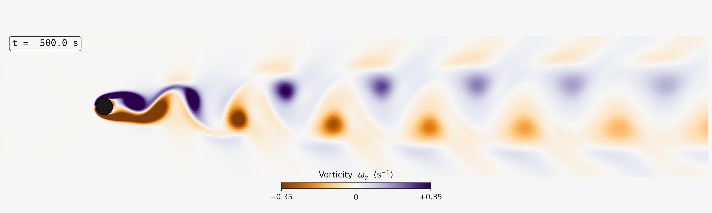

<!--
SPDX-FileCopyrightText: 2025-2026 Mohamed Mousa
SPDX-License-Identifier: Apache-2.0
-->

# Validation: Cylinder Vortex Street

This folder validates Turblyze's **transient** solver, the implicit-Euler
time scheme plus the PISO pressure-velocity coupling, against the classic
von Kármán vortex street behind a circular cylinder.

The case is laminar at Re ≈ 150, run as a quasi-2D domain: a
single-cell-width mesh bounded by symmetry planes on both spanwise sides.

## Figure



Spanwise vorticity ω_y in the mid-span plane (PuOr diverging map, orange/purple
mark opposite rotation senses), showing the alternating vortex street in the
developed limit cycle.

## Case

| Parameter | Value |
|---|---|
| Cylinder diameter D | 0.1 m |
| Free-stream velocity U | 0.02191 m/s |
| Density / viscosity | 1.225 kg/m³ / 1.7894e-5 Pa·s |
| Reynolds number | ≈ 150 |
| Algorithm | PISO (2 PRIME correctors) |
| Time scheme | implicitEuler, Δt = 0.05 s (Courant ≈ 0.68) |
| Total time | 600 s (12 000 steps) |
| Turbulence | Laminar |
| Spanwise sides | symmetry planes (mesh-derived) |

## Results

Force coefficients over the developed limit cycle (t > 360 s, ~7 shedding
cycles). Shedding onset is at t ≈ 204 s.

| Quantity | Turblyze | Benchmark (Re ≈ 150) |
|---|---|---|
| Mean drag Cd | 1.27 | ≈ 1.33 |
| Lift amplitude Cl | ±0.23 | ≈ ±0.4 |
| Strouhal St = f·D/U | 0.156 | ≈ 0.18–0.19 |

The mean drag falls within ~5% of the benchmark. The shedding is somewhat
damped — the Strouhal number and lift amplitude sit below the reference values,
consistent with residual numerical diffusion and the finite lateral blockage of
the domain. Sharpening the near-wake resolution is the natural next step to pull
St and Cl toward the textbook values.

## Reproduce

See [`runGuide.md`](runGuide.md). In short: run `cylinderCase` to completion,
then

```bash
python3 validation/cylinder/scripts/analyze_forces.py \
    outputFiles.nosync/cylinder_forces.csv          # Cd / Cl / Strouhal
python3 validation/cylinder/scripts/render_vortex.py batch <framedir>  # animation frames
```

The analysis script requires `numpy`; the render script additionally requires
`h5py`, `scipy`, and `matplotlib` (plus `ffmpeg` to encode the frames).
